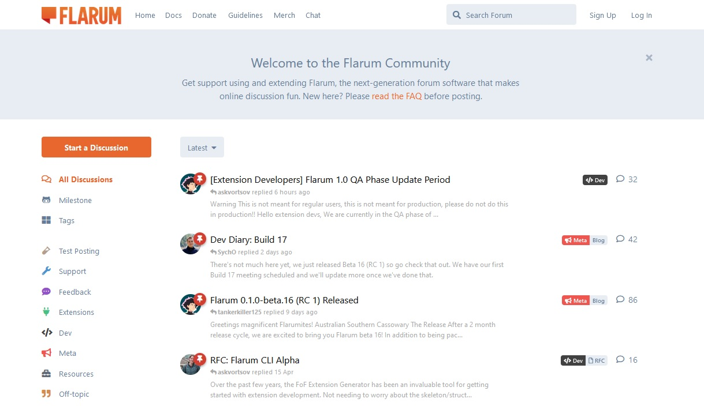

<!--
N.B.: This README was automatically generated by https://github.com/YunoHost/apps/tree/master/tools/README-generator
It shall NOT be edited by hand.
-->

# Flarum for YunoHost

[](https://dash.yunohost.org/appci/app/flarum)    
[](https://install-app.yunohost.org/?app=flarum)

*[Lire ce readme en français.](./README_fr.md)*

> *This package allows you to install Flarum quickly and simply on a YunoHost server.
If you don't have YunoHost, please consult [the guide](https://yunohost.org/#/install) to learn how to install it.*

## Overview

Next-generation forum made simple

**Shipped version:** 1.0.0~ynh5

**Demo:** https://discuss.flarum.org/d/21101-demos-come-to-flarum

## Screenshots



## Disclaimers / important information

### Installing

- The installation requires at least 1GB of free memory. A swap file of this size will be created if needed.
- You can select the default language (among English `en` by default, French `fr`, and German `de`). Other languages can be added after installation like any other extension.

### Using

After installation, simply open your browser to Flarum's page. First loading may be a bit longer as assets are generated.

This app allows your YunoHost users to log in with a [dedicated LDAP extension](https://github.com/tituspijean/flarum-ext-auth-ldap). By default, the standard logging method is hidden.
To allow non-YunoHost users to log in, the LDAP extension setting is in the admin panel.

### Upgrading

Note that, for the moment, all third-party extensions are removed upon upgrading.

### Adding extensions

Flarum does not offer to install extensions from its admin panel yet, so you need to use the command line.

Replace `flarum` with your app ID in case of multiple installations.
Replace `vendor/extension` with the appropriate names. Read the extension documentation if it requires additional steps.

```bash
sudo su
app=flarum
cd /var/www/$app
sudo -u $app php7.3 composer.phar require vendor/extension
```

#### Troubleshooting

##### `Timeout` errors
Some users have reported a successful installation, but get a blank page due to a `timeout` on a PHP script that prepares the forum assests (`Minify.php`, notably).

In `/etc/php/*php_version*/fpm/pool.d/*app_id*.conf`, you can increase the `max_execution_time` and `max_input_time` limits (both values are in seconds if nothing is specified).

Reload PHP-FPM with `sudo service php*php_version*-fpm reload`.

##### Upload limit
If you are facing an error while uploading large files into the forum, PHP may be limiting file upload.

In `/etc/php/*php_version*/fpm/pool.d/*app_id*.conf`, you can uncomment (remove `;` at the beginning of the line) and increase the values of `upload_max_filesize` and `post_max_size` (both values are in bytes).

Reload PHP-FPM with `sudo service php*php_version*-fpm reload`.

## Documentation and resources

* Official app website: https://flarum.org
* Official admin documentation: https://docs.flarum.org
* Upstream app code repository: https://github.com/flarum/flarum
* YunoHost documentation for this app: https://yunohost.org/app_flarum
* Report a bug: https://github.com/YunoHost-Apps/flarum_ynh/issues

## Developer info

Please send your pull request to the [testing branch](https://github.com/YunoHost-Apps/flarum_ynh/tree/testing).

To try the testing branch, please proceed like that.
```
sudo yunohost app install https://github.com/YunoHost-Apps/flarum_ynh/tree/testing --debug
or
sudo yunohost app upgrade flarum -u https://github.com/YunoHost-Apps/flarum_ynh/tree/testing --debug
```

**More info regarding app packaging:** https://yunohost.org/packaging_apps